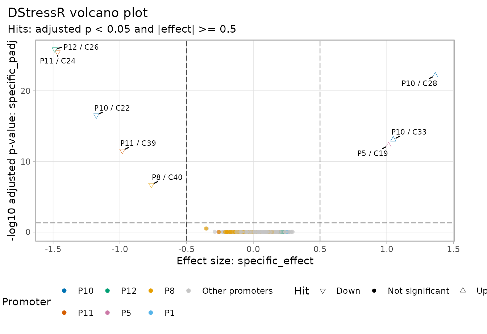
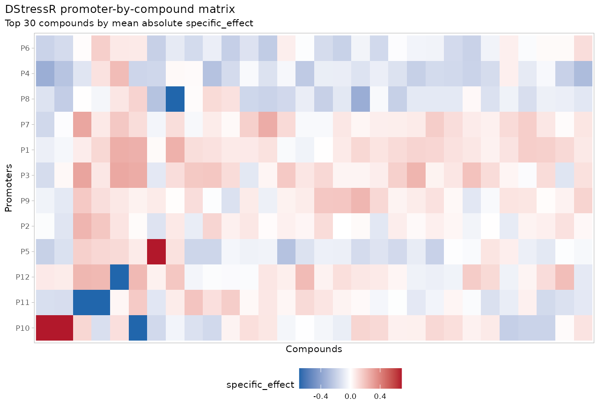

# Get started with DStressR

`DStressR` models promoter-activity responses in high-throughput
chemical genomics screens. The package is designed as the
stress-response counterpart to
[`DGrowthR`](https://bio-datascience.github.io/DGrowthR/): DGrowthR
handles growth-curve modeling, while DStressR handles promoter-compound
effects after accounting for growth and technical structure.

This vignette uses a small simulated screen so that the model-based
named workflow can be run without private data files. DStressR also
exposes compatibility workflows through the same entry point:
`workflow = "median_polish"` for the original median-polish p-value
workflow and `workflow = "empty_vector_control"` for the
empty-vector-control workflow.

## Input files and table shape

DStressR expects a long measurement table with one row per measured
promoter-compound-replicate observation. In a complete rectangular
screen, the row count is approximately:

``` text
n_promoters x (n_compound_wells + n_control_wells) x n_replicates
```

The table may contain additional rows when the same screen is repeated
across batches, library plates, measurement plates, or experimental
days. The important point is that these technical covariates remain in
the table so they can be modeled rather than accidentally averaged away.

The required biological and technical information is:

- promoter or reporter construct
- compound or library-well identifier
- negative-control compound, usually `DMSO`
- luminescence summary
- growth summary
- replicate and optional technical covariates such as batch or plate

Column names are not fixed. They are mapped explicitly in
[`prepare_assay()`](https://bio-datascience.github.io/DStressR/reference/prepare_assay.md).

For the original Campylobacter promoter-library workflow, the
convenience helper
[`read_campylobacter_expression()`](https://bio-datascience.github.io/DStressR/reference/read_campylobacter_expression.md)
joins two exported files:

- `expression_values.tsv.gz`: one row per
  promoter-library-well-replicate observation. It must contain either
  `srn_code` or both `libplate` and `well`, plus the promoter,
  luminescence, growth, and technical columns used downstream.
- `LibMap.txt`: one row per compound/library well with columns
  `Library plate`, `Well`, `ProductName`, and `Catalog Number`.

The helper reconstructs the library-well key as
`paste0("lp", Library plate, "_", Well)` for `LibMap.txt`, joins the
compound annotations onto the expression table, and returns a long table
with the same number of rows as `expression_values.tsv.gz`.

``` r

expression_df <- read_campylobacter_expression(
  expression_file = "expression_values.tsv.gz",
  libmap_file = "LibMap.txt"
)

assay <- prepare_assay(
  expression_df,
  promoter = "promoter",
  compound = "srn_code",
  control = "DMSO",
  lux = "LUX.AUC_16",
  growth = "od_16h.measured",
  batch = "batch",
  plate = "libplate",
  replicate = "replicate"
)
```

## Simulate a chemical-genomics screen

``` r

library(DStressR)

screen <- simulate_screen(
  n_promoters = 12,
  n_compounds = 40,
  n_replicates = 3,
  seed = 1
)

head(screen)
#>   promoter compound replicate batch od_16h.measured LUX.AUC_16 truth_specific
#> 1       P1     DMSO        r1    b2       0.4116687   293.9048              0
#> 2       P2     DMSO        r1    b2       0.3906898   432.5738              0
#> 3       P3     DMSO        r1    b2       0.3333026   235.1525              0
#> 4       P4     DMSO        r1    b2       0.3000495   850.4902              0
#> 5       P5     DMSO        r1    b2       0.3410560   346.1222              0
#> 6       P6     DMSO        r1    b2       0.5140298   378.6924              0
#>   truth_global
#> 1            0
#> 2            0
#> 3            0
#> 4            0
#> 5            0
#> 6            0
```

The simulated table contains one row per promoter-compound-replicate
well. It includes luminescence, growth, batch, replicate, and hidden
truth columns used only to check the example.

``` r

names(screen)
#> [1] "promoter"        "compound"        "replicate"       "batch"          
#> [5] "od_16h.measured" "LUX.AUC_16"      "truth_specific"  "truth_global"
```

## Prepare the assay

[`prepare_assay()`](https://bio-datascience.github.io/DStressR/reference/prepare_assay.md)
converts luminescence and growth summaries into a growth-adjusted log2
response. By default, DStressR estimates promoter-specific growth
exponents from DMSO control wells and shrinks them toward a global
control-well slope.

``` r

assay <- prepare_assay(
  screen,
  promoter = "promoter",
  compound = "compound",
  control = "DMSO",
  lux = "LUX.AUC_16",
  growth = "od_16h.measured",
  batch = "batch",
  replicate = "replicate"
)

attr(assay, "destress")$growth_exponent_fit
#>    promoter control_n log_growth_sd alpha_raw alpha_raw_se alpha_raw_df
#> 1        P1         3     0.2789856        NA           NA           NA
#> 2       P10         3     0.3303240        NA           NA           NA
#> 3       P11         3     0.2469301        NA           NA           NA
#> 4       P12         3     0.1029985        NA           NA           NA
#> 5        P2         3     0.1738257        NA           NA           NA
#> 6        P3         3     0.2105313        NA           NA           NA
#> 7        P4         3     0.2653313        NA           NA           NA
#> 8        P5         3     0.2447480        NA           NA           NA
#> 9        P6         3     0.1725935        NA           NA           NA
#> 10       P7         3     0.2267275        NA           NA           NA
#> 11       P8         3     0.2954055        NA           NA           NA
#> 12       P9         3     0.1714372        NA           NA           NA
#>    alpha_covariates alpha_global alpha_global_se  alpha_global_covariates
#> 1                      0.8875006       0.1613071 promoter;batch;replicate
#> 2                      0.8875006       0.1613071 promoter;batch;replicate
#> 3                      0.8875006       0.1613071 promoter;batch;replicate
#> 4                      0.8875006       0.1613071 promoter;batch;replicate
#> 5                      0.8875006       0.1613071 promoter;batch;replicate
#> 6                      0.8875006       0.1613071 promoter;batch;replicate
#> 7                      0.8875006       0.1613071 promoter;batch;replicate
#> 8                      0.8875006       0.1613071 promoter;batch;replicate
#> 9                      0.8875006       0.1613071 promoter;batch;replicate
#> 10                     0.8875006       0.1613071 promoter;batch;replicate
#> 11                     0.8875006       0.1613071 promoter;batch;replicate
#> 12                     0.8875006       0.1613071 promoter;batch;replicate
#>    alpha_prior_var alpha_prior_sd alpha_shrunk alpha_shrunk_se alpha_fixed_one
#> 1       0.02601998      0.1613071    0.8875006       0.1613071               1
#> 2       0.02601998      0.1613071    0.8875006       0.1613071               1
#> 3       0.02601998      0.1613071    0.8875006       0.1613071               1
#> 4       0.02601998      0.1613071    0.8875006       0.1613071               1
#> 5       0.02601998      0.1613071    0.8875006       0.1613071               1
#> 6       0.02601998      0.1613071    0.8875006       0.1613071               1
#> 7       0.02601998      0.1613071    0.8875006       0.1613071               1
#> 8       0.02601998      0.1613071    0.8875006       0.1613071               1
#> 9       0.02601998      0.1613071    0.8875006       0.1613071               1
#> 10      0.02601998      0.1613071    0.8875006       0.1613071               1
#> 11      0.02601998      0.1613071    0.8875006       0.1613071               1
#> 12      0.02601998      0.1613071    0.8875006       0.1613071               1
#>    alpha_diff_from_one
#> 1           -0.1124994
#> 2           -0.1124994
#> 3           -0.1124994
#> 4           -0.1124994
#> 5           -0.1124994
#> 6           -0.1124994
#> 7           -0.1124994
#> 8           -0.1124994
#> 9           -0.1124994
#> 10          -0.1124994
#> 11          -0.1124994
#> 12          -0.1124994
```

To reproduce the older fixed-ratio style response, `growth_exponent = 1`
gives the familiar `log2(luminescence / growth)` scale.

``` r

assay_fixed <- prepare_assay(
  screen,
  promoter = "promoter",
  compound = "compound",
  control = "DMSO",
  lux = "LUX.AUC_16",
  growth = "od_16h.measured",
  growth_exponent = 1,
  batch = "batch",
  replicate = "replicate"
)
```

## Fit the model workflow

`fit_workflow(..., workflow = "model")` fits promoter and compound
effects while accounting for technical covariates. The result table
reports both the DMSO-relative total effect and the promoter-specific
effect after subtracting the compound-wide effect.

``` r

fit <- fit_workflow(
  assay,
  workflow = "model",
  technical = c("batch", "replicate"),
  empirical_bayes = TRUE
)

tab <- results(fit)
tab <- adjust_pvalues(tab)

head(tab)
#>    compound promoter total_effect  total_se total_statistic total_pvalue
#> 1        C1       P1  -0.42759639 0.1281559      -3.3365325 0.0008801098
#> 13      C10       P1   0.11008012 0.1281559       0.8589546 0.3905751788
#> 25      C11       P1  -0.40523361 0.1281559      -3.1620358 0.0016147508
#> 37      C12       P1   0.28971870 0.1281559       2.2606736 0.0239977008
#> 49      C13       P1   0.04093903 0.1281559       0.3194471 0.7494554690
#> 61      C14       P1  -0.06382475 0.1281559      -0.4980242 0.6185784855
#>    additive_total_effect additive_total_se global_effect specific_effect
#> 1            -0.54331614        0.05251494   -0.54331614      0.11571976
#> 13            0.03412472        0.05251494    0.03412472      0.07595540
#> 25           -0.53613209        0.05251494   -0.53613209      0.13089849
#> 37            0.20219166        0.05251494    0.20219166      0.08752703
#> 49            0.01268673        0.05251494    0.01268673      0.02825231
#> 61           -0.01999624        0.05251494   -0.01999624     -0.04382851
#>    specific_se specific_statistic specific_pvalue total_padj specific_padj
#> 1    0.1281559          0.9029607       0.3667682 0.01107970     0.9737499
#> 13   0.1281559          0.5926796       0.5535320 0.61067129     0.9737499
#> 25   0.1281559          1.0214002       0.3073164 0.01684957     0.9737499
#> 37   0.1281559          0.6829730       0.4947850 0.11359472     0.9737499
#> 49   0.1281559          0.2204526       0.8255645 0.86893388     0.9737499
#> 61   0.1281559         -0.3419937       0.7324288 0.79178046     0.9737499
#>    specific_padj_by_promoter
#> 1                  0.8462255
#> 13                 0.8462255
#> 25                 0.8462255
#> 37                 0.8462255
#> 49                 0.9435023
#> 61                 0.8877925
```

The key columns are:

- `total_effect`: DMSO-relative response for the promoter-compound pair.
- `global_effect`: average compound-wide response across promoters.
- `specific_effect`: promoter-specific deviation from the compound-wide
  effect.
- `specific_pvalue` and `specific_padj`: test and BH-adjusted p-value.

The direct fitting functions remain available for existing scripts, but
[`fit_workflow()`](https://bio-datascience.github.io/DStressR/reference/fit_workflow.md)
makes the selected statistical path explicit and is the recommended
entry point for new analyses.

## Call hits

``` r

hits <- call_hits(
  tab,
  fdr = 0.05,
  lfc = 0.5,
  effect = "specific_effect",
  padj = "specific_padj"
)

table(hits$hit)
#> 
#> Downregulated        Not DE   Upregulated 
#>             5           472             3

head(
  hits[order(hits$specific_padj, -abs(hits$specific_effect)), ],
  10
)
#>     compound promoter total_effect  total_se total_statistic total_pvalue
#> 220      C26      P12   -1.3710711 0.1281559      -10.698461 2.418737e-25
#> 195      C24      P11   -1.6735292 0.1281559      -13.058540 4.726357e-36
#> 242      C28      P10    1.4895866 0.1281559       11.623237 2.371113e-29
#> 170      C22      P10   -1.6257162 0.1281559      -12.685456 2.948783e-34
#> 314      C33      P10    0.9705429 0.1281559        7.573141 8.390830e-14
#> 128      C19       P5    1.0692457 0.1281559        8.343319 2.427872e-16
#> 387      C39      P11   -1.2130464 0.1281559       -9.465395 2.098332e-20
#> 419      C40       P8   -0.7506326 0.1281559       -5.857182 6.417479e-09
#> 107      C17       P8   -0.2232267 0.1281559       -1.741837 8.185016e-02
#> 247      C28       P4   -0.2227294 0.1281559       -1.737956 8.253198e-02
#>     additive_total_effect additive_total_se global_effect specific_effect
#> 220            0.11664730        0.05251494    0.11664730      -1.4877184
#> 195           -0.20714467        0.05251494   -0.20714467      -1.4663846
#> 242            0.12623694        0.05251494    0.12623694       1.3633497
#> 170           -0.44954782        0.05251494   -0.44954782      -1.1761684
#> 314           -0.07827537        0.05251494   -0.07827537       1.0488183
#> 128            0.05542205        0.05251494    0.05542205       1.0138237
#> 387           -0.23137805        0.05251494   -0.23137805      -0.9816684
#> 419            0.01355452        0.05251494    0.01355452      -0.7641871
#> 107            0.13065534        0.05251494    0.13065534      -0.3538820
#> 247            0.12623694        0.05251494    0.12623694      -0.3489663
#>     specific_se specific_statistic specific_pvalue   total_padj specific_padj
#> 220   0.1281559         -11.608660    2.754737e-29 2.902484e-23  1.322274e-26
#> 195   0.1281559         -11.442192    1.511721e-28 2.268651e-33  3.628130e-26
#> 242   0.1281559          10.638211    4.324175e-25 3.793781e-27  6.918680e-23
#> 170   0.1281559          -9.177636    2.535797e-19 7.077080e-32  3.042956e-17
#> 314   0.1281559           8.183924    8.466026e-16 5.753712e-12  8.127385e-14
#> 128   0.1281559           7.910861    6.860599e-15 1.942298e-14  5.488479e-13
#> 387   0.1281559          -7.659954    4.447819e-14 2.014399e-18  3.049933e-12
#> 419   0.1281559          -5.962948    3.452276e-09 3.850488e-07  2.071366e-07
#> 107   0.1281559          -2.761340    5.863824e-03 2.470948e-01  3.127373e-01
#> 247   0.1281559          -2.722982    6.584238e-03 2.475960e-01  3.160434e-01
#>     specific_padj_by_promoter           hit
#> 220              1.101895e-27 Downregulated
#> 195              6.046883e-27 Downregulated
#> 242              1.729670e-23   Upregulated
#> 170              5.071593e-18 Downregulated
#> 314              1.128804e-14   Upregulated
#> 128              2.744240e-13   Upregulated
#> 387              8.895637e-13 Downregulated
#> 419              1.380910e-07 Downregulated
#> 107              1.172765e-01        Not DE
#> 247              2.633695e-01        Not DE
```

In real screens, the FDR cutoff should be paired with domain knowledge
and diagnostics. For DMSO-rich designs, empirical replicate/permutation
p-values can be used as an additional calibration check.

## Visualize the screen

The standard volcano plot labels the strongest promoter-compound pairs.

``` r

plot_volcano(
  hits,
  effect = "specific_effect",
  padj = "specific_padj",
  fdr = 0.05,
  lfc = 0.5,
  top_n = 8,
  top_promoters = 6
)
```



A response heatmap gives a matrix-level view of the promoter-compound
response surface.

``` r

plot_response_heatmap(
  hits,
  value = "specific_effect",
  top_n_compounds = 30
)
```



For broader screens, clustered heatmaps help reveal compound and
promoter groups with similar response profiles.

``` r

plot_response_clustered_heatmap(
  hits,
  value = "specific_effect",
  top_n_compounds = 30,
  title = "Clustered DStressR response map"
)
```


## Optional DGrowthR handoff

The current default hit model uses the exported growth summary column
supplied to
[`prepare_assay()`](https://bio-datascience.github.io/DStressR/reference/prepare_assay.md).
If growth curves have already been modeled with DGrowthR, the
DGrowthR-derived growth parameter can be joined explicitly before assay
preparation.

``` r

screen2 <- add_dgrowthr_growth(
  screen,
  object = dgrowthr_fit,
  by = "curve_id",
  model_covariate = "curve_id",
  growth_metric = "OD_16",
  output = "dgrowthr_od16"
)

assay2 <- prepare_assay(
  screen2,
  promoter = "promoter",
  compound = "compound",
  control = "DMSO",
  lux = "LUX.AUC_16",
  growth = "dgrowthr_od16",
  batch = "batch",
  replicate = "replicate"
)
```

This explicit handoff keeps the selected DStressR workflow reproducible,
while making DGrowthR-based sensitivity analyses straightforward.
