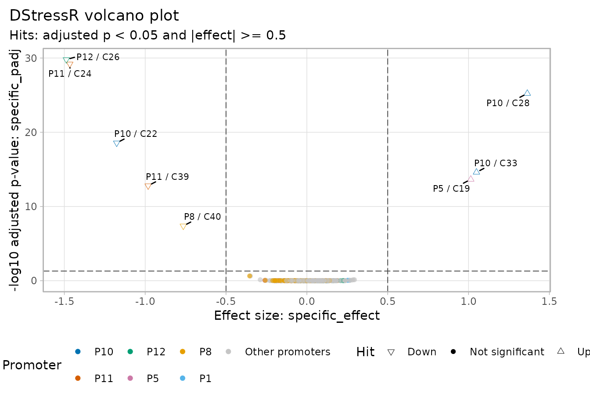
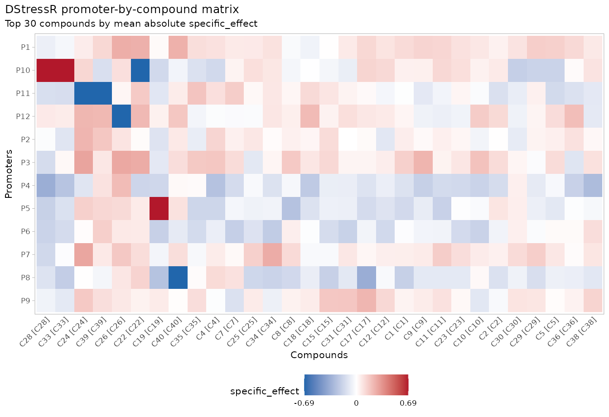

# Get started with DStressR

`DStressR` models promoter-activity responses in high-throughput
chemical genomics screens. The package is designed as the
stress-response counterpart to
[`DGrowthR`](https://bio-datascience.github.io/DGrowthR/): DGrowthR
handles growth-curve modeling, while DStressR handles promoter-compound
effects after accounting for growth and technical structure.

This vignette uses a small simulated screen so that the model-based
named workflow can be run without private data files. DStressR also
exposes compatibility workflows through the same entry point:
`workflow = "median_polish"` for the original median-polish p-value
workflow and `workflow = "empty_vector_control"` for the
empty-vector-control workflow.

## Input files and table shape

DStressR expects a long measurement table with one row per measured
promoter-compound-replicate observation. In a complete rectangular
screen, the row count is approximately:

``` text
n_promoters x (n_compound_wells + n_control_wells) x n_replicates
```

The table may contain additional rows when the same screen is repeated
across batches, library plates, measurement plates, or experimental
days. The important point is that these technical covariates remain in
the table so they can be modeled rather than accidentally averaged away.

The required biological and technical information is:

- promoter or reporter construct
- compound or library-well identifier
- negative-control compound, usually `DMSO`
- luminescence summary
- growth summary
- replicate and optional technical covariates such as batch or plate

Column names are not fixed. They are mapped explicitly in
[`prepare_assay()`](https://muellsen.github.io/DStressR/reference/prepare_assay.md).

For the original Campylobacter promoter-library workflow, the
convenience helper
[`read_campylobacter_expression()`](https://muellsen.github.io/DStressR/reference/read_campylobacter_expression.md)
joins two exported files:

- `expression_values.tsv.gz`: one row per
  promoter-library-well-replicate observation. It must contain either
  `srn_code` or both `libplate` and `well`, plus the promoter,
  luminescence, growth, and technical columns used downstream.
- `LibMap.txt`: one row per compound/library well with columns
  `Library plate`, `Well`, `ProductName`, and `Catalog Number`.

The helper reconstructs the library-well key as
`paste0("lp", Library plate, "_", Well)` for `LibMap.txt`, joins the
compound annotations onto the expression table, and returns a long table
with the same number of rows as `expression_values.tsv.gz`.

``` r

expression_df <- read_campylobacter_expression(
  expression_file = "expression_values.tsv.gz",
  libmap_file = "LibMap.txt"
)

assay <- prepare_assay(
  expression_df,
  promoter = "promoter",
  compound = "srn_code",
  control = "DMSO",
  lux = "LUX.AUC_16",
  growth = "od_16h.measured",
  batch = "batch",
  plate = "libplate",
  replicate = "replicate"
)
```

## Simulate a chemical-genomics screen

``` r

library(DStressR)

screen <- simulate_screen(
  n_promoters = 12,
  n_compounds = 40,
  n_replicates = 3,
  seed = 1
)

head(screen)
#>   promoter compound replicate batch od_16h.measured LUX.AUC_16 truth_specific
#> 1       P1     DMSO        r1    b2       0.4116687   293.9048              0
#> 2       P2     DMSO        r1    b2       0.3906898   432.5738              0
#> 3       P3     DMSO        r1    b2       0.3333026   235.1525              0
#> 4       P4     DMSO        r1    b2       0.3000495   850.4902              0
#> 5       P5     DMSO        r1    b2       0.3410560   346.1222              0
#> 6       P6     DMSO        r1    b2       0.5140298   378.6924              0
#>   truth_global
#> 1            0
#> 2            0
#> 3            0
#> 4            0
#> 5            0
#> 6            0
```

The simulated table contains one row per promoter-compound-replicate
well. It includes luminescence, growth, batch, replicate, and hidden
truth columns used only to check the example.

``` r

names(screen)
#> [1] "promoter"        "compound"        "replicate"       "batch"          
#> [5] "od_16h.measured" "LUX.AUC_16"      "truth_specific"  "truth_global"
```

## Prepare the assay

[`prepare_assay()`](https://muellsen.github.io/DStressR/reference/prepare_assay.md)
converts luminescence and growth summaries into a growth-adjusted log2
response. By default, DStressR estimates promoter-specific growth
exponents from DMSO control wells and shrinks them toward a global
control-well slope.

``` r

assay <- prepare_assay(
  screen,
  promoter = "promoter",
  compound = "compound",
  control = "DMSO",
  lux = "LUX.AUC_16",
  growth = "od_16h.measured",
  batch = "batch",
  replicate = "replicate"
)

attr(assay, "destress")$growth_exponent_fit
#>    promoter control_n log_growth_sd a_raw a_raw_se a_raw_df alpha_raw
#> 1        P1         3     0.2789856    NA       NA       NA        NA
#> 2       P10         3     0.3303240    NA       NA       NA        NA
#> 3       P11         3     0.2469301    NA       NA       NA        NA
#> 4       P12         3     0.1029985    NA       NA       NA        NA
#> 5        P2         3     0.1738257    NA       NA       NA        NA
#> 6        P3         3     0.2105313    NA       NA       NA        NA
#> 7        P4         3     0.2653313    NA       NA       NA        NA
#> 8        P5         3     0.2447480    NA       NA       NA        NA
#> 9        P6         3     0.1725935    NA       NA       NA        NA
#> 10       P7         3     0.2267275    NA       NA       NA        NA
#> 11       P8         3     0.2954055    NA       NA       NA        NA
#> 12       P9         3     0.1714372    NA       NA       NA        NA
#>    alpha_raw_se alpha_raw_df alpha_covariates alpha_global alpha_global_se
#> 1            NA           NA                     0.8875006       0.1613071
#> 2            NA           NA                     0.8875006       0.1613071
#> 3            NA           NA                     0.8875006       0.1613071
#> 4            NA           NA                     0.8875006       0.1613071
#> 5            NA           NA                     0.8875006       0.1613071
#> 6            NA           NA                     0.8875006       0.1613071
#> 7            NA           NA                     0.8875006       0.1613071
#> 8            NA           NA                     0.8875006       0.1613071
#> 9            NA           NA                     0.8875006       0.1613071
#> 10           NA           NA                     0.8875006       0.1613071
#> 11           NA           NA                     0.8875006       0.1613071
#> 12           NA           NA                     0.8875006       0.1613071
#>     alpha_global_covariates alpha_prior_var alpha_prior_sd alpha_shrunk
#> 1  promoter;batch;replicate      0.02601998      0.1613071    0.8875006
#> 2  promoter;batch;replicate      0.02601998      0.1613071    0.8875006
#> 3  promoter;batch;replicate      0.02601998      0.1613071    0.8875006
#> 4  promoter;batch;replicate      0.02601998      0.1613071    0.8875006
#> 5  promoter;batch;replicate      0.02601998      0.1613071    0.8875006
#> 6  promoter;batch;replicate      0.02601998      0.1613071    0.8875006
#> 7  promoter;batch;replicate      0.02601998      0.1613071    0.8875006
#> 8  promoter;batch;replicate      0.02601998      0.1613071    0.8875006
#> 9  promoter;batch;replicate      0.02601998      0.1613071    0.8875006
#> 10 promoter;batch;replicate      0.02601998      0.1613071    0.8875006
#> 11 promoter;batch;replicate      0.02601998      0.1613071    0.8875006
#> 12 promoter;batch;replicate      0.02601998      0.1613071    0.8875006
#>    alpha_shrunk_se alpha_fixed_one alpha_diff_from_one
#> 1        0.1613071               1          -0.1124994
#> 2        0.1613071               1          -0.1124994
#> 3        0.1613071               1          -0.1124994
#> 4        0.1613071               1          -0.1124994
#> 5        0.1613071               1          -0.1124994
#> 6        0.1613071               1          -0.1124994
#> 7        0.1613071               1          -0.1124994
#> 8        0.1613071               1          -0.1124994
#> 9        0.1613071               1          -0.1124994
#> 10       0.1613071               1          -0.1124994
#> 11       0.1613071               1          -0.1124994
#> 12       0.1613071               1          -0.1124994
```

To reproduce the older fixed-ratio style response, `growth_exponent = 1`
gives the familiar `log2(luminescence / growth)` scale.

``` r

assay_fixed <- prepare_assay(
  screen,
  promoter = "promoter",
  compound = "compound",
  control = "DMSO",
  lux = "LUX.AUC_16",
  growth = "od_16h.measured",
  growth_exponent = 1,
  batch = "batch",
  replicate = "replicate"
)
```

## Fit the model workflow

[`fit_destress()`](https://muellsen.github.io/DStressR/reference/fit_destress.md)
fits promoter and compound effects while accounting for technical
covariates. The result table reports both the DMSO-relative total effect
and the promoter-specific effect after subtracting the compound-wide
effect.

``` r

fit <- fit_destress(
  assay,
  technical = c("batch", "replicate"),
  empirical_bayes = TRUE
)

tab <- results(fit)
tab <- adjust_pvalues(tab)

head(tab)
#>    promoter compound total_effect  total_se total_statistic total_pvalue
#> 1        P1       C1  -0.42759639 0.1286067      -3.3248384 0.0008847299
#> 21       P1      C10   0.11008012 0.1286067       0.8559441 0.3920289226
#> 34       P1      C11  -0.40523361 0.1286067      -3.1509533 0.0016274332
#> 47       P1      C12   0.28971870 0.1286067       2.2527502 0.0242751218
#> 58       P1      C13   0.04093903 0.1286067       0.3183274 0.7502366381
#> 67       P1      C14  -0.06382475 0.1286067      -0.4962787 0.6196979032
#>    additive_total_effect additive_total_se empty_vector_effect
#> 1                     NA                NA                  NA
#> 21                    NA                NA                  NA
#> 34                    NA                NA                  NA
#> 47                    NA                NA                  NA
#> 58                    NA                NA                  NA
#> 67                    NA                NA                  NA
#>    background_adjusted_effect global_effect global_se global_statistic
#> 1                 -0.42759639   -0.54331614 0.0371256      -14.6345430
#> 21                 0.11008012    0.03412472 0.0371256        0.9191695
#> 34                -0.40523361   -0.53613209 0.0371256      -14.4410363
#> 47                 0.28971870    0.20219166 0.0371256        5.4461525
#> 58                 0.04093903    0.01268673 0.0371256        0.3417245
#> 67                -0.06382475   -0.01999624 0.0371256       -0.5386106
#>    global_pvalue low_rank_effect specific_effect specific_se specific_statistic
#> 1   2.486990e-24               0      0.11571976   0.1239068          0.9339261
#> 21  3.607701e-01               0      0.07595540   0.1239068          0.6130045
#> 34  5.403585e-24               0      0.13089849   0.1239068          1.0564273
#> 47  5.511408e-07               0      0.08752703   0.1239068          0.7063943
#> 58  7.334543e-01               0      0.02825231   0.1239068          0.2280126
#> 67  5.916512e-01               0     -0.04382851   0.1239068         -0.3537217
#>    specific_pvalue total_padj_global total_padj_by_promoter
#> 1        0.3503422        0.01114009             0.02671743
#> 21       0.5398735        0.61294424             0.54072955
#> 34       0.2907733        0.01698191             0.02671743
#> 47       0.4799431        0.11490814             0.09710049
#> 58       0.8196365        0.86983958             0.78972278
#> 67       0.7235475        0.79321332             0.70822618
#>    specific_padj_global specific_padj_by_promoter total_padj specific_padj
#> 1             0.9710323                 0.8293604 0.01114009     0.9710323
#> 21            0.9710323                 0.8293604 0.61294424     0.9710323
#> 34            0.9710323                 0.8293604 0.01698191     0.9710323
#> 47            0.9710323                 0.8293604 0.11490814     0.9710323
#> 58            0.9710323                 0.9367274 0.86983958     0.9710323
#> 67            0.9710323                 0.8770273 0.79321332     0.9710323
```

The key columns are:

- `total_effect`: DMSO-relative response for the promoter-compound pair.
- `global_effect`: average compound-wide response across promoters.
- `specific_effect`: promoter-specific deviation from the compound-wide
  effect.
- `specific_pvalue` and `specific_padj`: test and BH-adjusted p-value.

The direct fitting functions remain available for existing scripts, but
[`fit_destress()`](https://muellsen.github.io/DStressR/reference/fit_destress.md)
is the recommended entry point for new model-based analyses.

## Optional background reporter calibration

If a screen contains a matched background reporter, such as an Empty
Vector Control, the background reporter can be used during response
construction. When `background_promoter` is supplied, DStressR uses
Huber calibration by default; least-squares calibration and direct
subtraction remain available through `background_method`.

``` r

assay_bg <- prepare_assay(
  screen_with_evc,
  promoter = "promoter",
  compound = "compound",
  control = "DMSO",
  lux = "LUX.AUC_16",
  growth = "od_16h.measured",
  batch = "batch",
  replicate = "replicate",
  background_promoter = "EVC",
  background_by = c("compound", "batch", "replicate")
)

fit_bg <- fit_destress(
  assay_bg,
  technical = c("batch", "replicate"),
  empirical_bayes = TRUE
)
```

## Call hits

``` r

hits <- call_hits(
  tab,
  fdr = 0.05,
  lfc = 0.5,
  effect = "specific_effect",
  padj = "specific_padj"
)

table(hits$hit)
#> 
#> Downregulated        Not DE   Upregulated 
#>             5           472             3

head(
  hits[order(hits$specific_padj, -abs(hits$specific_effect)), ],
  10
)
#>     promoter compound total_effect  total_se total_statistic total_pvalue
#> 218      P12      C26   -1.3710711 0.1286071      -10.660929 1.555518e-26
#> 197      P11      C24   -1.6735292 0.1286071      -13.012726 1.043345e-38
#> 244      P10      C28    1.4895866 0.1286077       11.582410 5.083461e-31
#> 177      P10      C22   -1.6257162 0.1286077      -12.640897 1.264264e-36
#> 324      P10      C33    0.9705429 0.1286077        7.546540 4.473479e-14
#> 131       P5      C19    1.0692457 0.1286080        8.313991 9.264966e-17
#> 387      P11      C39   -1.2130464 0.1286071       -9.432187 4.024404e-21
#> 410       P8      C40   -0.7506326 0.1286064       -5.836665 5.327233e-09
#> 98        P8      C17   -0.2232267 0.1286064       -1.735735 8.261100e-02
#> 248       P4      C28   -0.2227294 0.1286069       -1.731862 8.329848e-02
#>     additive_total_effect additive_total_se empty_vector_effect
#> 218                    NA                NA                  NA
#> 197                    NA                NA                  NA
#> 244                    NA                NA                  NA
#> 177                    NA                NA                  NA
#> 324                    NA                NA                  NA
#> 131                    NA                NA                  NA
#> 387                    NA                NA                  NA
#> 410                    NA                NA                  NA
#> 98                     NA                NA                  NA
#> 248                    NA                NA                  NA
#>     background_adjusted_effect global_effect global_se global_statistic
#> 218                 -1.3710711    0.11664730 0.0371256        3.1419644
#> 197                 -1.6735292   -0.20714467 0.0371256       -5.5795647
#> 244                  1.4895866    0.12623694 0.0371256        3.4002668
#> 177                 -1.6257162   -0.44954782 0.0371256      -12.1088374
#> 324                  0.9705429   -0.07827537 0.0371256       -2.1083935
#> 131                  1.0692457    0.05542205 0.0371256        1.4928259
#> 387                 -1.2130464   -0.23137805 0.0371256       -6.2323053
#> 410                 -0.7506326    0.01355452 0.0371256        0.3650989
#> 98                  -0.2232267    0.13065534 0.0371256        3.5192791
#> 248                 -0.2227294    0.12623694 0.0371256        3.4002668
#>     global_pvalue low_rank_effect specific_effect specific_se
#> 218  2.353286e-03               0      -1.4877184   0.1239068
#> 197  3.182447e-07               0      -1.4663846   0.1239068
#> 244  1.052706e-03               0       1.3633497   0.1239068
#> 177  8.955951e-20               0      -1.1761684   0.1239068
#> 324  3.812631e-02               0       1.0488183   0.1239068
#> 131  1.394162e-01               0       1.0138237   0.1239068
#> 387  2.024970e-08               0      -0.9816684   0.1239068
#> 410  7.160010e-01               0      -0.7641871   0.1239068
#> 98   7.170824e-04               0      -0.3538820   0.1239068
#> 248  1.052706e-03               0      -0.3489663   0.1239068
#>     specific_statistic specific_pvalue total_padj_global total_padj_by_promoter
#> 218         -12.006758    3.291619e-33      1.866622e-24           6.222073e-25
#> 197         -11.834581    2.599217e-32      5.008056e-36           4.173380e-37
#> 244          11.003029    3.708851e-28      8.133537e-29           1.016692e-29
#> 177          -9.492367    2.263163e-21      3.034233e-34           5.057056e-35
#> 324           8.464577    2.574244e-17      3.067528e-12           5.964639e-13
#> 131           8.182150    2.791458e-16      7.411973e-15           3.705986e-15
#> 387          -7.922638    2.327607e-15      3.863428e-19           8.048807e-20
#> 410          -6.167437    6.943232e-10      3.196340e-07           1.623456e-07
#> 98           -2.856035    4.289771e-03      2.493917e-01           2.863950e-01
#> 248          -2.816362    4.857182e-03      2.498954e-01           2.221293e-01
#>     specific_padj_global specific_padj_by_promoter   total_padj specific_padj
#> 218         1.579977e-30              1.316648e-31 1.866622e-24  1.579977e-30
#> 197         6.238121e-30              1.039687e-30 5.008056e-36  6.238121e-30
#> 244         5.934161e-26              1.483540e-26 8.133537e-29  5.934161e-26
#> 177         2.715796e-19              4.526326e-20 3.034233e-34  2.715796e-19
#> 324         2.471274e-15              3.432325e-16 3.067528e-12  2.471274e-15
#> 131         2.233166e-14              1.116583e-14 7.411973e-15  2.233166e-14
#> 387         1.596073e-13              4.655213e-14 3.863428e-19  1.596073e-13
#> 410         4.165939e-08              2.777293e-08 3.196340e-07  4.165939e-08
#> 98          2.287878e-01              8.579543e-02 2.493917e-01  2.287878e-01
#> 248         2.331447e-01              1.942873e-01 2.498954e-01  2.331447e-01
#>               hit
#> 218 Downregulated
#> 197 Downregulated
#> 244   Upregulated
#> 177 Downregulated
#> 324   Upregulated
#> 131   Upregulated
#> 387 Downregulated
#> 410 Downregulated
#> 98         Not DE
#> 248        Not DE
```

In real screens, the FDR cutoff should be paired with domain knowledge
and diagnostics. For DMSO-rich designs, empirical replicate/permutation
p-values can be used as an additional calibration check.

## Visualize the screen

The standard volcano plot labels the strongest promoter-compound pairs.

``` r

plot_volcano(
  hits,
  effect = "specific_effect",
  padj = "specific_padj",
  fdr = 0.05,
  lfc = 0.5,
  top_n = 8,
  top_promoters = 6
)
```



A response heatmap gives a matrix-level view of the promoter-compound
response surface.

``` r

plot_response_heatmap(
  hits,
  value = "specific_effect",
  top_n_compounds = 30
)
```



For broader screens, clustered heatmaps help reveal compound and
promoter groups with similar response profiles.

``` r

plot_response_clustered_heatmap(
  hits,
  value = "specific_effect",
  top_n_compounds = 30,
  title = "Clustered DStressR response map"
)
```


## Optional DGrowthR handoff

The current default hit model uses the exported growth summary column
supplied to
[`prepare_assay()`](https://muellsen.github.io/DStressR/reference/prepare_assay.md).
If growth curves have already been modeled with DGrowthR, the
DGrowthR-derived growth parameter can be joined explicitly before assay
preparation.

``` r

screen2 <- add_dgrowthr_growth(
  screen,
  object = dgrowthr_fit,
  by = "curve_id",
  model_covariate = "curve_id",
  growth_metric = "OD_16",
  output = "dgrowthr_od16"
)

assay2 <- prepare_assay(
  screen2,
  promoter = "promoter",
  compound = "compound",
  control = "DMSO",
  lux = "LUX.AUC_16",
  growth = "dgrowthr_od16",
  batch = "batch",
  replicate = "replicate"
)
```

This explicit handoff keeps the selected DStressR workflow reproducible,
while making DGrowthR-based sensitivity analyses straightforward.
