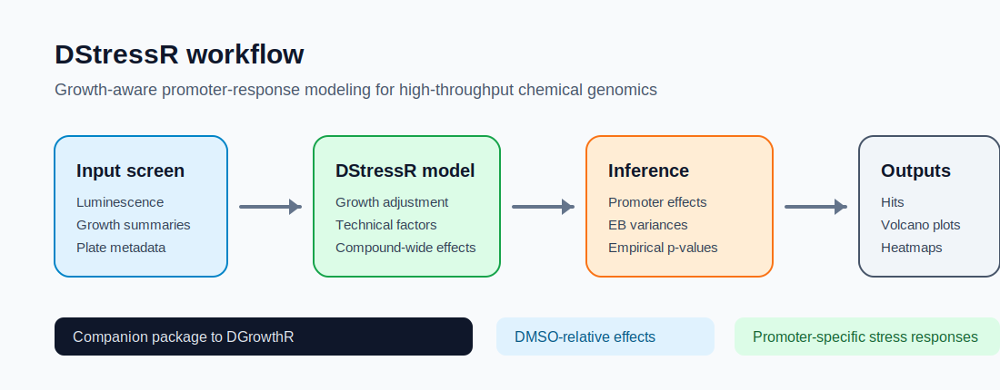

# DStressR: Differential stress-response modeling for chemical genomics screens


This repository hosts the `DStressR` R package and companion analysis
workflow for high-throughput bacterial chemical genomics screens.
`DStressR` is designed to go hand in hand with
[`DGrowthR`](https://bio-datascience.github.io/DGrowthR/): `DGrowthR`
models bacterial growth curves, while `DStressR` models
promoter-activity responses after accounting for growth, compound-wide
effects, technical covariates, and promoter-specific uncertainty.



> \[!TIP\] `DStressR` is intended as the promoter-response counterpart
> to [`DGrowthR`](https://bio-datascience.github.io/DGrowthR/). The
> current default hit-determination workflow is based on the original
> exported luminescence and growth summaries; DGrowthR-derived growth
> parameters can be handed over explicitly for sensitivity analyses.

## Installation Guide

To install the `DStressR` R package directly from this repository, first
clone the repository and enter the cloned folder. Then execute the
following commands in R.

1.  Ensure that you have the `devtools` package installed. If not, you
    can install it using the following command:

``` r

# Install devtools
install.packages("devtools")

# Load the library
library(devtools)
```

2.  Use the `install` function to install the `DStressR` package:

``` r

install()
```

For permutation-based empirical p-values, install the
[`permApprox`](https://github.com/stefpeschel/permApprox) package:

``` r

remotes::install_github("stefpeschel/permApprox")
```

## Get started

DStressR exposes statistical analyses through a staged
[`fit_destress()`](https://bio-datascience.github.io/DStressR/reference/fit_destress.md)
interface. The major choices are explicit: normalization, test statistic
and p-value calculation, replicate aggregation, and p-value adjustment.
Named presets reproduce the established workflows:

- `preset = "model"` for the model-based DStressR analysis
- `preset = "median_polish"` for the original median-polish p-value
  workflow
- `preset = "empty_vector_control"` for the Empty Vector Control
  workflow

The model workflow starts from an assay prepared with
[`prepare_assay()`](https://bio-datascience.github.io/DStressR/reference/prepare_assay.md):

``` r

library(DStressR)

screen <- simulate_screen(seed = 1)

assay <- prepare_assay(
  screen,
  promoter = "promoter",
  compound = "compound",
  control = "DMSO",
  lux = "LUX.AUC_16",
  growth = "od_16h.measured",
  batch = "batch",
  replicate = "replicate"
)

fit <- fit_destress(
  assay,
  preset = "model",
  technical = c("batch", "replicate"),
  empirical_bayes = TRUE
)

tab <- results(fit)
hits <- call_hits(tab, fdr = 0.05, effect = "specific_effect")
```

Equivalently, using staged options directly:

``` r

fit <- fit_destress(
  screen,
  normalization = "model",
  testing = "moderated_t",
  aggregation = "none",
  adjustment = "global",
  promoter = "promoter",
  compound = "compound",
  control = "DMSO",
  lux = "LUX.AUC_16",
  growth = "od_16h.measured",
  growth_exponent = "estimate",
  batch = "batch",
  replicate = "replicate",
  technical = c("batch", "replicate")
)
```

Growth-response normalization for the model path is controlled in
[`prepare_assay()`](https://bio-datascience.github.io/DStressR/reference/prepare_assay.md)
or by passing the same arguments through
[`fit_destress()`](https://bio-datascience.github.io/DStressR/reference/fit_destress.md).
Use `growth_exponent = 1` for the fixed log2(LUX / OD) normalization,
`growth_exponent = "estimate"` to estimate promoter-specific `alpha_g`
values from controls, or pass a named promoter vector.

## Model-based Empty Vector Control

If the screen contains an Empty Vector Control (EVC) reporter, it can be
used inside the model-based
[`fit_destress()`](https://bio-datascience.github.io/DStressR/reference/fit_destress.md)
workflow. This is different from the project-level
`preset = "empty_vector_control"` workflow below: the model-based path
still fits promoter-specific linear models, but additionally estimates
the DMSO-relative EVC response for each compound.

``` r

assay <- prepare_assay(
  expression_df,
  promoter = "promoter",
  compound = "srn_code",
  control = "DMSO",
  lux = "LUX.AUC_16",
  growth = "od_16h.measured",
  batch = "batch",
  replicate = "replicate"
)

fit <- fit_destress(
  assay,
  preset = "model",
  technical = c("batch", "replicate"),
  empirical_bayes = TRUE,
  empty_vector_promoter = "PEVC3"
)

tab <- results(fit)
```

The result table then includes additional columns:

- `empty_vector_effect`: fitted DMSO-relative response of the EVC
  reporter for the compound.
- `background_adjusted_effect`: fitted total response after subtracting
  `empty_vector_effect`.
- `specific_effect`: promoter-specific response after compound-wise
  centering.

For an additive compound-level EVC background, the subtraction cancels
from the centered `specific_effect`. This means the EVC option is most
useful for reporting and diagnosing background-adjusted total responses,
while the final model-based hit calls still target promoter-specific
deviations from the compound-wide average.

Estimated model components, including growth-exponent parameters and
promoter-compound effect estimates, can be extracted with:

``` r

params <- model_parameters(fit)

growth_parameters <- params$growth_exponents
promoter_effects <- params$promoter_effects
```

The median-polish compatibility workflow starts from the original
exported expression table and DMSO library-well IDs:

``` r

legacy <- fit_destress(
  expression_df,
  preset = "median_polish",
  response = "log2.auc.16hmeasured.normed",
  control = dmso_srn_codes,
  exclude = dmso_noisy_srn_codes,
  normality = TRUE
)

dmso_normality <- legacy$normality_results
replicate_pvalues <- legacy$replicate_results
hit_table <- legacy$pair_results
```

The Empty Vector Control workflow uses the same named interface:

``` r

evc <- fit_destress(
  expression_df,
  preset = "empty_vector_control",
  response = "log2.lux.normed.centered",
  empty_vector_promoter = "PEVC3",
  control = dmso_srn_codes,
  exclude = dmso_noisy_srn_codes
)

hit_table <- evc$pair_results
```

## How to use `DStressR`

The typical DStressR analysis starts from promoter-level luminescence
and growth summaries, together with compound, promoter, replicate,
plate, and batch metadata.

``` r

library(DStressR)

assay <- prepare_assay(
  expression_df,
  promoter = "promoter",
  compound = "srn_code",
  control = "DMSO",
  lux = "LUX.AUC_16",
  growth = "od_16h.measured",
  batch = "batch",
  replicate = "replicate"
)

fit <- fit_destress(
  assay,
  normalization = "model",
  testing = "moderated_t",
  aggregation = "none",
  adjustment = "global",
  technical = c("batch", "replicate"),
)

tab <- results(fit)
hits <- call_hits(tab, fdr = 0.05, effect = "specific_effect")
```

The fitted model separates two related quantities:

- `total_effect`: DMSO-relative promoter response for a compound.
- `specific_effect`: promoter-specific response after subtracting the
  compound-wide effect shared across promoters.

This distinction is important for compounds that globally perturb
growth, luminescence, metabolism, or assay chemistry.

The compatibility wrapper
[`fit_workflow()`](https://bio-datascience.github.io/DStressR/reference/fit_workflow.md)
and the lower-level functions
[`fit_median_polish()`](https://bio-datascience.github.io/DStressR/reference/fit_median_polish.md)
and
[`fit_empty_vector_control()`](https://bio-datascience.github.io/DStressR/reference/fit_empty_vector_control.md)
remain available for existing scripts. New analyses should prefer
[`fit_destress()`](https://bio-datascience.github.io/DStressR/reference/fit_destress.md)
so that the selected statistical path is explicit in the code.

## Standard plots

`DStressR` includes standard output plots for common screening
summaries, including volcano plots, promoter-compound response heatmaps,
clustered heatmaps, effect histograms, and empirical-Bayes variance
diagnostics.

``` r

plot_volcano(
  tab,
  effect = "specific_effect",
  padj = "specific_padj",
  top_n = 12,
  top_promoters = 6
)

plot_response_heatmap(
  tab,
  value = "specific_effect"
)
```

## Required input shape

DStressR expects a long promoter-compound table with one row per
measured promoter-compound-replicate observation. In a complete
rectangular screen, the number of rows is approximately:

``` text
n_promoters x (n_compound_wells + n_control_wells) x n_replicates
```

Additional rows can occur when the same design is repeated across
batches, library plates, measurement plates, or experimental days.

At minimum, the expression table must contain columns that identify:

- promoter or reporter construct, for example `promoter`
- compound or library well, for example `compound`, `srn_code`, or
  `libplate` plus `well`
- negative-control compound, usually `DMSO`
- luminescence summary, for example `LUX.AUC_16`
- growth summary, for example `od_16h.measured`
- replicate and technical covariates, for example `replicate`, `batch`,
  `plate`, or `libplate`

These columns are mapped explicitly in
[`prepare_assay()`](https://bio-datascience.github.io/DStressR/reference/prepare_assay.md),
so projects can use their own column names:

``` r

assay <- prepare_assay(
  expression_df,
  promoter = "promoter",
  compound = "srn_code",
  control = "DMSO",
  lux = "LUX.AUC_16",
  growth = "od_16h.measured",
  batch = "batch",
  plate = "libplate",
  replicate = "replicate"
)
```

## Campylobacter workflow input files

For the original Campylobacter promoter-library workflow, DStressR
includes the helper
[`read_campylobacter_expression()`](https://bio-datascience.github.io/DStressR/reference/read_campylobacter_expression.md).
It joins two exported files:

1.  `expression_values.tsv.gz`

    A long measurement table with one row per
    promoter-library-well-replicate observation. It should contain
    either:

    - `srn_code`, a unique library-well identifier, or
    - both `libplate` and `well`, from which `srn_code` is reconstructed
      as `paste(libplate, well, sep = "_")`.

    It should also contain the promoter identifier, luminescence
    summary, growth summary, and technical covariates used downstream in
    [`prepare_assay()`](https://bio-datascience.github.io/DStressR/reference/prepare_assay.md).

2.  `LibMap.txt`

    A library annotation table with one row per compound/library well.
    Required columns are:

    - `Library plate`
    - `Well`
    - `ProductName`
    - `Catalog Number`

    The helper converts these to a compound key
    `srn_code = paste0("lp", Library plate, "_", Well)` and joins
    `ProductName` and `Catalog Number` onto the expression table.

``` r

expression_df <- read_campylobacter_expression(
  expression_file = "expression_values.tsv.gz",
  libmap_file = "LibMap.txt"
)
```

The returned object has the same number of rows as
`expression_values.tsv.gz`, with compound annotations added. This joined
table can then be passed directly to
[`prepare_assay()`](https://bio-datascience.github.io/DStressR/reference/prepare_assay.md).

To reproduce the original median-polish workflow, provide the DMSO
library-well IDs and optional noisy-DMSO well IDs from `LibMap.txt`:

``` r

libmap <- read.delim("LibMap.txt", check.names = FALSE)
libmap$srn_code <- paste0("lp", libmap[["Library plate"]], "_", libmap[["Well"]])

dmso_srn_codes <- libmap$srn_code[libmap$ProductName == "DMSO"]
dmso_noisy_srn_codes <- libmap$srn_code[libmap$ProductName == "DMSO noisy"]

legacy <- fit_destress(
  expression_df,
  preset = "median_polish",
  response = "log2.auc.16hmeasured.normed",
  control = dmso_srn_codes,
  exclude = dmso_noisy_srn_codes,
  normality = TRUE
)

dmso_normality <- legacy$normality_results
replicate_pvalues <- legacy$replicate_results
hit_table <- legacy$pair_results
```

## Salmonella Empty Vector workflow

The Salmonella workflow uses a stronger control design than DMSO-only
normalization. In addition to DMSO wells, it includes Empty Vector
Control reporters, especially `PEVC3`, which measure compound-specific
background Lux signal without a promoter insert. DStressR exposes this
baseline through
[`fit_empty_vector_control()`](https://bio-datascience.github.io/DStressR/reference/fit_empty_vector_control.md).

The required processed expression table is the output of the Salmonella
Lux-estimation step, usually `lux_auc_filtered_median.tsv.gz`. It is a
long table with one row per promoter-library-well-replicate observation
and contains:

- `promoter`
- `srn_code`
- `replicate`
- `log2.lux.normed.centered`

The library map is `LibMap.tsv.gz`, with columns:

- `Library plate`
- `New well`
- `Catalog Number`
- `ProductName`

``` r

expression_df <- read.delim(gzfile("lux_auc_filtered_median.tsv.gz"),
                            check.names = FALSE)
libmap <- read.delim(gzfile("LibMap.tsv.gz"), check.names = FALSE)

libmap$libplate <- sub("LibPlate", "lp", libmap[["Library plate"]])
libmap$srn_code <- paste(libmap$libplate, libmap[["New well"]], sep = "_")

dmso_srn_codes <- libmap$srn_code[libmap[["Catalog Number"]] == "DMSO"]
dmso_noisy_srn_codes <- libmap$srn_code[libmap[["Catalog Number"]] == "DMSO noisy"]

evc <- fit_destress(
  expression_df,
  preset = "empty_vector_control",
  response = "log2.lux.normed.centered",
  empty_vector_promoter = "PEVC3",
  control = dmso_srn_codes,
  exclude = dmso_noisy_srn_codes,
  remove_promoters = "PmgrR"
)

replicate_pvalues <- evc$replicate_results
hit_table <- evc$pair_results
```

On the local Salmonella workflow output, this DStressR implementation
recovers the original `hit_table.tsv.gz` numerically, including the
final hit labels.

## Optional DGrowthR handoff

If growth curves have already been modeled with DGrowthR, DStressR can
use a chosen DGrowthR growth parameter as the growth column for a
sensitivity analysis:

``` r

expression_df2 <- add_dgrowthr_growth(
  expression_df,
  object = dgrowthr_fit,
  by = "curve_id",
  model_covariate = "curve_id",
  growth_metric = "OD_16",
  output = "dgrowthr_od16"
)

assay <- prepare_assay(
  expression_df2,
  promoter = "promoter",
  compound = "srn_code",
  control = "DMSO",
  lux = "LUX.AUC_16",
  growth = "dgrowthr_od16"
)
```

## Analysis workflow

The `analysis/` folder contains scripts used during model development
and benchmarking against the original median-polish workflow, including
p-value comparisons, empirical-Bayes diagnostics, response matrices,
clustered heatmaps, network summaries, and empirical
replicate/permutation tests.
